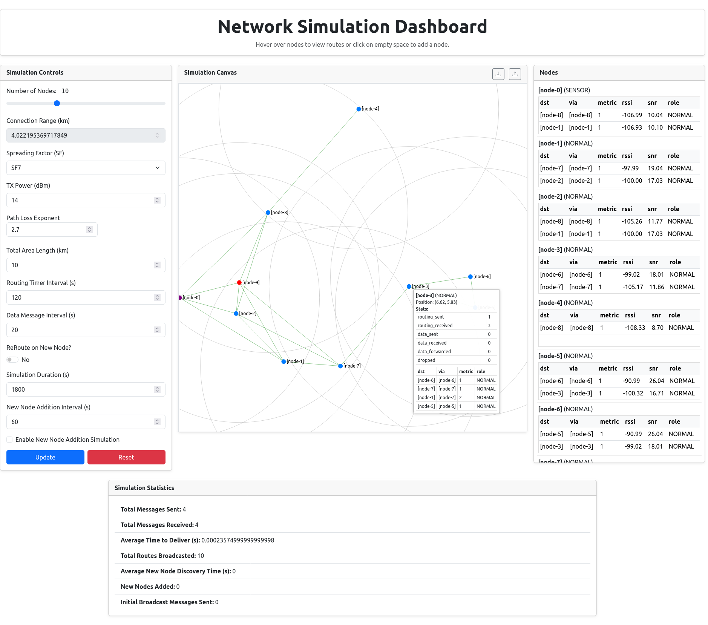

# LoRaMesher-style Network Simulator (Python • Flask • Socket.IO)

A small, interactive simulator to study a **LoRa mesh** network’s control and data planes and to **collect routing/data-delivery statistics**.
The backend is Python (Flask + Flask-SocketIO). The frontend is a single HTML page (vanilla JS + SVG) that talks to the server over WebSockets, renders the topology, and exposes live controls.

> This project **does not emulate the full LoRa physical/MAC layer**. It uses a simplified link model and hop-count metric with SNR tiebreaks to explore routing spread and message delivery latency at the network layer.

---

## Contents

* [Quick start](#quick-start)
* [What’s in the box](#whats-in-the-box)
* [How it works](#how-it-works)

  * [Node model](#node-model)
  * [Routing protocol](#routing-protocol)
  * [Data plane](#data-plane)
  * [Radio/link model](#radiolink-model)
  * [Timers & scheduling](#timers--scheduling)
  * [Statistics](#statistics)
* [Frontend UI](#frontend-ui)
* [Socket.IO API](#socketio-api)
* [Topology file format](#topology-file-format)
* [Configuration & defaults](#configuration--defaults)
* [Project layout](#project-layout)
* [Extending the simulator](#extending-the-simulator)
* [Limitations](#limitations)
* [FAQ](#faq)

---

 

## Quick start

1. **Install** Python 3.10+ and dependencies:

   ```bash
   pip install Flask Flask-SocketIO
   ```

   (The server runs with `async_mode="threading"`, so you don’t need eventlet/gevent.)

2. **Run** the server:

   ```bash
   python app.py
   ```

   Open [http://localhost:5000](http://localhost:5000) in your browser.

3. **Play** with the sliders and switches, add nodes, upload/download topologies, and watch the SVG view update live.

---

## What’s in the box

* **Live topology view** (SVG): nodes, connection-range rings, and inferred neighbor links (drawn by distance).
* **Routing spread**: periodic routing advertisements propagate hop counts; receiving nodes update next hops.
* **Data generation**: nodes periodically send data toward the best known gateway.
* **Stats**: totals for messages sent/received, routes broadcast, average data delivery time, initial “flood” count, etc.
* **Topology I/O**: download the current topology as a `.tlg` CSV-like file; upload to replace the running topology.
* **Parameter controls**: number of nodes, area size, SF, TX power, path-loss exponent, routing/data intervals, and an option to *reroute immediately on new-node discovery*.

---

## How it works

### Node model

**Source:** `src/node.py`, `src/packet.py`, `src/constants.py`

Each `Node` has:

* `name` — e.g. `"[node-3]"`.
* `position` — 2D coordinates in **kilometers** within a square of side `SIZE_KM`.
* `connection_range` — **km**, derived from the LoRa link budget (see below).
* `role` — one of `GATEWAY`, `NORMAL`, `SENSOR` (enum `Role`).

Each node maintains a **routing table**:

```python
RoutingTable.routing_table: dict[str, dict] # per-destination entry:
{
  "metric": int,   # hop count
  "via": str,      # next hop neighbor name
  "rssi": float,   # estimated RSSI toward the destination (dBm)
  "snr":  float,   # estimated SNR toward the destination (dB)
  "role": Role     # known role of the destination
}
```

RSSI/SNR are computed with a log-distance path-loss model at *this* node’s distance to the destination.

Per-node **stats** are kept in `node.stats`:

```python
{
  "routing_sent": 0,
  "routing_received": 0,
  "data_sent": 0,
  "data_received": 0,
  "data_forwarded": 0,
  "dropped": 0
}
```

### Routing protocol

**Style:** Distance-Vector (DV) with hop-count metric; SNR used as a **tiebreaker**.

* **Advertisement:** on a routing timer, a node broadcasts a `RoutingPacket` containing its known routes as a map
  `dst -> RouteInfo(metric, role)`. (See `Node.broadcast_routing`.)
* **On receive:** the neighbor

  1. **Adds/refreshes** a route to the **sender** with `metric=1`.
  2. For every `dst` in the sender’s advertised table, **adds/updates** a candidate route
     with `metric = advertised.metric + 1` and `via = sender`.
  3. For each added/updated route it stores **RSSI/SNR** estimated from its own position to `dst`.
  4. If `reroute_on_new_node` is enabled and the routing table changed, it immediately re-advertises.

When a destination already exists in the table, a new candidate supersedes the stored one **only** if it has a **smaller hop count**, or (for equal hop counts) a **better SNR**. (See `RoutingTable.add_route`.)

> **Roles propagate:** gateways are advertised as `role=Role.GATEWAY`, so downstream nodes can discover them.

### Data plane

On a data timer each node tries to send an application `DataPacket` **toward the “best” gateway** it knows:

* **Best gateway selection:** among all `role==GATEWAY` entries, choose the **lowest hop count**, breaking ties by **highest SNR**.
  (See `Node.broadcast_data`: it sorts routing entries by `(metric, -snr)`.)
* **Forwarding:** the sender sets `via` to its next hop for the chosen gateway and **broadcasts**.
  Any receiver checks:

  * If it is **neither** `dst` **nor** the packet’s `via`, it **drops**.
  * If it **is** the `via` but not `dst`, it **forwards** by rewriting `via` to *its* next hop to `dst`.
  * If it **is the destination**, it **delivers**, increments receive counters and updates the global average delivery time.

> If a node knows **no gateway**, it increments the “initial broadcast” counter; nothing is delivered.

### Radio/link model

**Source:** `src/utils.py`

* **Connectivity:** two nodes can communicate iff Euclidean distance ≤ `connection_range` (km).
* **`connection_range` derivation:** computed from a **LoRa link budget** helper:

  ```python
  lora_max_range(tx_power_dbm, sf, frequency_mhz=868,
                 bandwidth_hz=125_000, noise_figure_db=6,
                 path_loss_exp=2.7, fade_margin_db=10, ...)
  -> max_range_m
  ```

  This uses:

  * SNR\_min vs SF (approx table for 125 kHz BW),
  * thermal noise and receiver NF to estimate **sensitivity**,
  * a log-distance path-loss model to invert for **max range**,
  * a **fade margin** (reserve) to keep the link conservative.
* **RSSI/SNR estimator:** `calculate_snr_rssi(distance_km, tx_power_dbm=20, bandwidth_hz=125e3, noise_figure_db=6, path_loss_exponent=2.7, ...)`.

> By default, **coordinates are in km**, and so is the connection range. The frontend scales the SVG accordingly.

### Timers & scheduling

* **Routing timer:** every `routing_interval` seconds, a node broadcasts its routes.
* **Data timer:** every `data_interval` seconds, a node attempts to send a data packet to the best gateway.
* **Jittered start:** each node schedules initial routing/data timers after `INITIAL_SETUP_TIME_SECS + random()` to avoid synchronization.
* **Background snapshots:** the server emits a topology snapshot and aggregate stats periodically (≈ every 2 s).

### Statistics

Global counters (class vars in `Node`) exposed to the UI:

* `total_messages_sent`
* `total_messages_received`
* `average_time_to_deliver` (seconds)
* `total_routes_broadcasted`
* `average_new_node_discovery_time` *(running average; updated when new nodes are added)*
* `new_nodes_added`
* `initial_broadcast_messages_sent` *(data attempts made before any gateway is known)*

---

## Frontend UI

**Source:** `templates/index.html`, `static/script.js`, `static/styles.css`

* **Canvas (SVG) view:** shows nodes as circles with labels and **connection-range rings**. Lines are drawn between any node pairs whose distance ≤ current range (purely visual).
* **Controls panel:**

  * **Simulation**: enable timed addition of random nodes; set duration and inter-arrival interval.
  * **Topology**: buttons to **Download** current topology (`.tlg`) and **Upload** a saved topology.
  * **Parameters**:

    * Number of nodes
    * Area size (`SIZE_KM`)
    * Spreading Factor (`SF`)
    * TX power (dBm)
    * Path-loss exponent
    * Routing/Data intervals (seconds)
    * “Reroute on new node” (immediate re-advert)
  * **Apply**: sends the updated parameters to the backend and resets the simulation with the new context.
* **Stats panel:** shows the global counters listed above, updated live.

---

## Socket.IO API

All events are **namespaced at the default namespace**.

### Server → Client

* **`snapshot`**

  ```json
  {
    "nodes": [
      {
        "name": "[node-0]",
        "x": 1.23,
        "y": 6.78,
        "role": "NORMAL",
        "routes": [
          {"dst":"[node-9]","via":"[node-4]","metric":3,"rssi":-102.3,"snr":8.7,"role":"GATEWAY"}
        ],
        "stats": {"routing_sent":3,"routing_received":7,"data_sent":2,"data_received":1,"data_forwarded":5,"dropped":0}
      }
    ]
  }
  ```

* **`statistics`**

  ```json
  {
    "total_messages_sent": 42,
    "total_messages_received": 21,
    "average_time_to_deliver": 3.08,
    "total_routes_broadcasted": 105,
    "average_new_node_discovery_time": 2.5,
    "new_nodes_added": 3,
    "initial_broadcast_messages_sent": 4
  }
  ```

* **`range_update`**

  ```json
  {"connection_range_km": 2.91}
  ```

  Emitted after parameter updates so the UI can redraw range rings.

* **`topology_data`** (response to download request)

  ```json
  { "nodes": [ { "name":"[node-0]", "x":1.2, "y":3.4, "role":"NORMAL" }, ... ] }
  ```

### Client → Server

* **`update`**
  Reconfigures and **recreates** the simulation with the provided context.

  ```json
  {
    "num_nodes": 25,
    "area_length": 10,              // SIZE_KM
    "sf": 9,
    "tx_power": 14,                 // dBm
    "path_loss_exp": 2.7,
    "routing_interval": 120,        // seconds
    "data_interval": 30,            // seconds
    "reroute_on_new_node": true
  }
  ```

  The server recomputes `connection_range_km = lora_max_range(...) / 1000`, emits `range_update`, and sends a fresh `snapshot`.

* **`add_node`**
  Adds a single **NORMAL** node at the given position (km).

  ```json
  { "position": [ x_km, y_km ] }
  ```

  Used by the UI’s “Enable Simulation” feature to inject nodes at a fixed interval.

* **`reset`**
  Clears all nodes and stats; recreates the default simulation.

* **`download_topology`**
  Requests the current topology (server responds with `topology_data`).

* **`load_topology`**
  Replaces the simulation with a supplied topology (see format below):

  ```json
  { "nodes": [ {"x":1.0,"y":2.0,"role":"GATEWAY"}, {"x":4.0,"y":7.0,"role":"NORMAL"} ] }
  ```

* **Connection lifecycle**: `connect`/`disconnect` are logged on the server.

---

## Topology file format

When you click **Download Topology**, the UI receives `topology_data` and saves a simple “.tlg” CSV-style text:

```
name,x,y,role
[node-0],1.2,3.4,NORMAL
[node-1],8.7,2.2,GATEWAY
...
```

* **Upload Topology** expects the same header.
* `role` must be one of: `GATEWAY`, `NORMAL`, `SENSOR`.
* If `name` is omitted on upload, the server will assign `"[node-i]"`.

> The server strips per-node `stats` and `routes` when preparing `topology_data`, so saved files are clean.

---

## Configuration & defaults

**Source:** `src/constants.py`

| Parameter                 | Default                                       | Notes                                                 |
| ------------------------- | --------------------------------------------- | ----------------------------------------------------- |
| `N`                       | `10`                                          | initial node count (used when not loading a topology) |
| `SIZE_KM`                 | `10`                                          | side length of the square simulation area             |
| `SF`                      | `7`                                           | spreading factor (7..12)                              |
| `TX_POWER_DBM`            | `14`                                          | transmit power                                        |
| `PATH_LOSS_EXPONENT`      | `2.7`                                         | \~2.0 free-space, ↑ for urban/indoor                  |
| `HELLO_TIME_SECS`         | `120`                                         | routing advertisement interval                        |
| `DATA_TIME_SECS`          | *(present in code; default used via context)* | data generation interval                              |
| `INITIAL_SETUP_TIME_SECS` | `2`                                           | plus random jitter                                    |
| `FREQUENCY_MHZ`           | `868.0`                                       | link-budget helper (EU868)                            |
| `BANDWIDTH_HZ`            | `125_000`                                     | link-budget helper                                    |
| `NOISE_FIGURE_DB`         | `6.0`                                         | link-budget helper                                    |

> **Connection range** is **derived**, not set directly: `connection_range_km = lora_max_range(tx_power_dbm, sf, path_loss_exp) / 1000`.
> The UI displays this live (`range_update`) and draws the rings with the current value.

**Roles:** `Role.GATEWAY`, `Role.NORMAL`, `Role.SENSOR`. By default **one gateway** is created when the simulator autogenerates nodes (the last node is assigned `GATEWAY` in `src/main.py`).

---

## Project layout

```
app.py                     # Flask + Socket.IO server, background emitter, event handlers
templates/
  └── index.html           # Frontend UI (controls + SVG canvas)
static/
  ├── script.js            # Frontend logic (rendering, Socket.IO, controls, topology I/O)
  ├── styles.css           # UI styling
  ├── bootstrap.min.css    # Vendor CSS
  ├── socket.io.min.js     # Vendor Socket.IO client
  ├── favicon.*            # Icons
src/
  ├── node.py              # Node class: routing/data logic, timers, per-node stats
  ├── packet.py            # Packet definitions and RoutingTable/Routes helpers
  ├── utils.py             # log-distance RSSI/SNR and LoRa max-range helpers
  ├── constants.py         # parameter defaults, enums (PacketType, Role)
  ├── main.py              # Context, create_simulation(), node generation
  └── html_template.py     # legacy canvas demo (not used by the main UI)
temp/
  └── avg-num-of-connections.py  # scratch script for expected degree sanity check
Makefile                   # (outdated) runs a non-existent main.py
README.md                  # (this file)
```

---

## Extending the simulator

* **Routing metric:** change how candidates supersede existing routes in `RoutingTable.add_route` (e.g., ETX, RSSI-weighted metrics).
* **Gateway selection:** adjust the sort in `Node.broadcast_data` (currently `(metric, -snr)`).
* **PHY realism:** replace the binary “in range? then deliver” in `Node.broadcast` with a **probabilistic delivery** using SNR and airtime; add collision/duty-cycle modeling.
* **Mobility:** periodically update `node.position` and trigger re-advertisement; the UI will reflect it via snapshots.
* **Multiple gateways & sinks:** allow different services/flows, per-flow routing, or load-balancing.
* **Security:** switch Socket.IO to a production async mode (eventlet/gevent) and lock down CORS if hosting publicly.

---

## Limitations

* **No MAC/Airtime/Collisions**: broadcasts deliver instantly to all in-range neighbors; no ADR, no capture effect, no regional duty-cycle enforcement.
* **Idealized channel**: only distance-based path loss + a fixed fade margin; no shadowing/fading variability.
* **Unit square in km**: the coordinate system is flat and dimensionless beyond the km scaling; there are no obstacles.
* **Single traffic pattern**: all nodes send to gateways; there’s no peer-to-peer traffic generator.

---

## FAQ

**Q: Why do some data packets “vanish”?**
A: If a node doesn’t know any gateway yet, it increments the *initial\_broadcast* counter and no delivery occurs. Also, a relay drops a packet if it is neither the destination nor the current `via` hop.

**Q: How do I create a gateway?**
A: Upload a topology with a node whose `role` is `GATEWAY`, or rely on the default autogenerated layout where the last node is a gateway.

**Q: What’s the expected average neighbor count?**
A: In a uniform random placement, the expected degree ≈ `π r² N / (2 L²)` where `r = connection_range_km`, `N` is node count, and `L = SIZE_KM`. See `temp/avg-num-of-connections.py` for an empirical check.

---

## Developer notes

* The server periodically emits:

  * `snapshot` (full node list, including each node’s `routes` and `stats`)
  * `statistics` (global counters)
* When handling `download_topology`, the server **removes** `routes` and `stats` before emitting `topology_data`.
* `clear_nodes()` cancels timers, resets all **global counters** and per-node handles, clears the `Node._all_nodes` list, and then un-stops the system so new timers can start.
* `Context` (in `src/main.py`) is the single source of truth for parameters.
  `create_simulation(context, node_info=None)` populates `Node._all_nodes` and sets:

  * `Node._routing_interval = context.routing_interval`
  * `Node._data_interval = context.data_interval`
  * `Node._reroute_on_new_node = context.reroute_on_new_node`
  * `context.connection_range_km = lora_max_range(...) / 1000`

